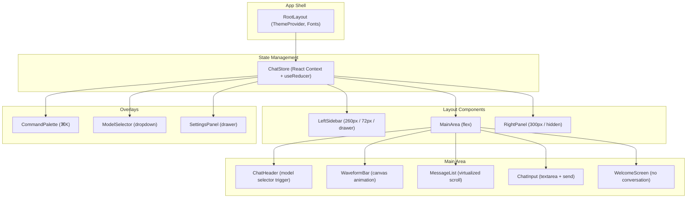
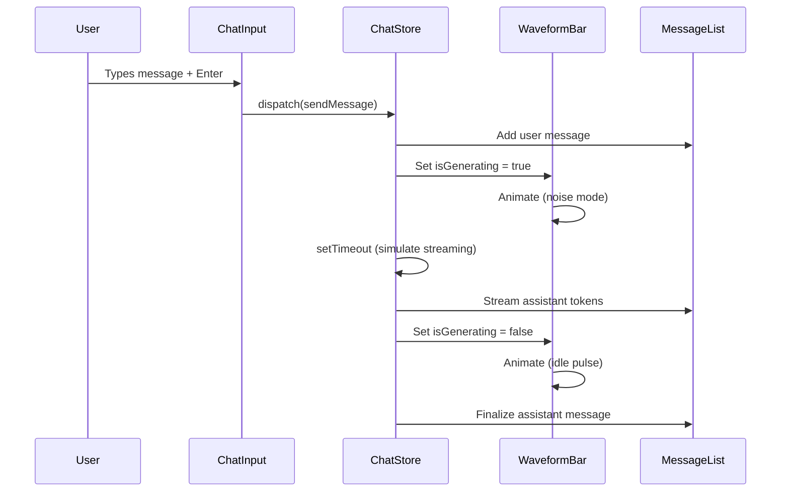
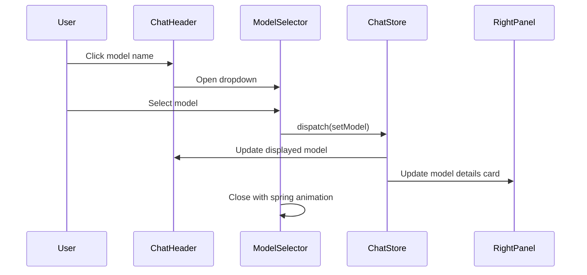
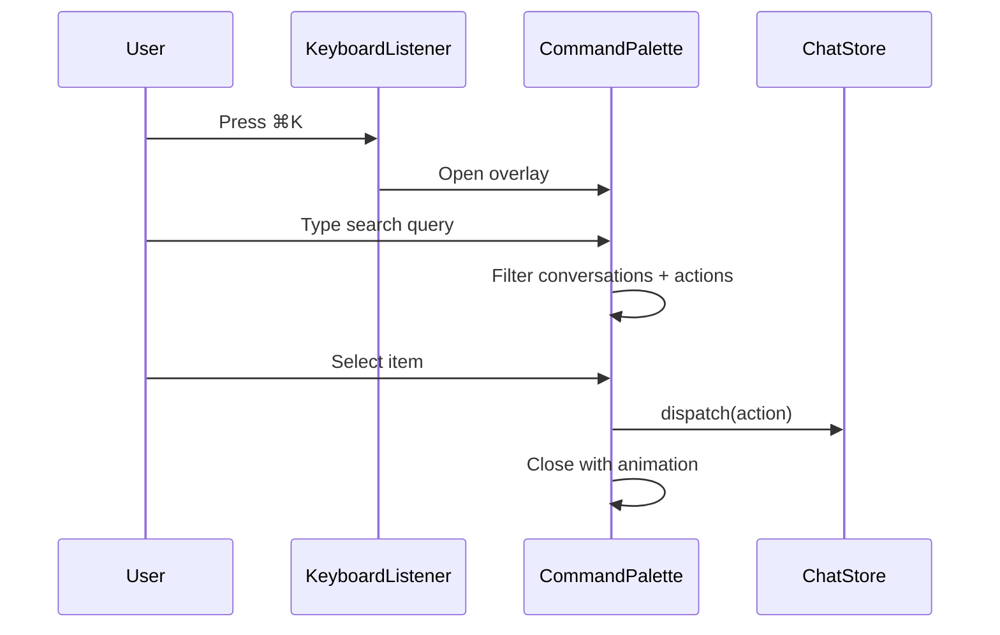

# Design Document: NeuraChat Frontend

## Overview

NeuraChat is a premium multi-model AI chat platform frontend with a "deep space workbench" aesthetic inspired by scientific instrument UIs. Built with Next.js 16, React 19, Tailwind CSS 4, Radix UI, shadcn, and Framer Motion, it delivers a fully interactive, visually polished UI using mock data and local state management.

The platform features a responsive three-column layout (desktop), model-frequency waveform animations that react to simulated streaming, a command palette, model selector, and a comprehensive design system with dark/light theming. All data is mocked locally — no backend integration.

## Architecture



## Sequence Diagrams

### Message Send Flow



### Model Switch Flow



### Command Palette Flow



## Components and Interfaces

### Component 1: ChatStore (State Management)

**Purpose**: Central state management using React Context + useReducer pattern. Manages all application state including conversations, selected model, UI states, and theme.

**Interface**:
```typescript
interface ChatState {
  conversations: Conversation[]
  activeConversationId: string | null
  selectedModel: AIModel
  isGenerating: boolean
  leftSidebarOpen: boolean
  rightPanelOpen: boolean
  theme: 'dark' | 'light'
  commandPaletteOpen: boolean
  settingsOpen: boolean
}

type ChatAction =
  | { type: 'SEND_MESSAGE'; payload: { content: string } }
  | { type: 'APPEND_TOKEN'; payload: { token: string } }
  | { type: 'FINALIZE_RESPONSE' }
  | { type: 'SET_MODEL'; payload: AIModel }
  | { type: 'NEW_CONVERSATION' }
  | { type: 'SELECT_CONVERSATION'; payload: { id: string } }
  | { type: 'DELETE_CONVERSATION'; payload: { id: string } }
  | { type: 'PIN_CONVERSATION'; payload: { id: string } }
  | { type: 'TOGGLE_LEFT_SIDEBAR' }
  | { type: 'TOGGLE_RIGHT_PANEL' }
  | { type: 'SET_THEME'; payload: 'dark' | 'light' }
  | { type: 'TOGGLE_COMMAND_PALETTE' }
  | { type: 'TOGGLE_SETTINGS' }
  | { type: 'SET_GENERATING'; payload: boolean }

interface ChatContextValue {
  state: ChatState
  dispatch: React.Dispatch<ChatAction>
  sendMessage: (content: string) => void
  activeConversation: Conversation | null
  activeMessages: Message[]
}
```

**Responsibilities**:
- Manage all UI and data state
- Handle simulated streaming with setTimeout
- Provide dispatch and convenience methods via context
- Persist theme preference to localStorage

### Component 2: LeftSidebar

**Purpose**: Navigation sidebar with conversation history, search trigger, and user controls.

**Interface**:
```typescript
interface LeftSidebarProps {
  // No props — reads from ChatStore context
}

// Internal sub-components
interface ConversationItemProps {
  conversation: Conversation
  isActive: boolean
  onSelect: () => void
  onPin: () => void
  onDelete: () => void
}
```

**Responsibilities**:
- Display logo and New Chat button
- Show pinned conversations section
- Show recent conversations grouped by date (Today, Yesterday, Previous 7 Days)
- Provide ⌘K search trigger
- Theme toggle (dark/light)
- User profile display
- Collapse to 72px icon-only on tablet, drawer on mobile

### Component 3: RightPanel (Model Panel)

**Purpose**: Display detailed information about the currently selected AI model with interactive controls.

**Interface**:
```typescript
interface RightPanelProps {
  // No props — reads from ChatStore context
}

interface ModelStatGridProps {
  model: AIModel
}

interface TemperatureSliderProps {
  value: number
  onChange: (value: number) => void
}
```

**Responsibilities**:
- Display model name, provider badge, description
- Show 2×2 stat grid (context window, parameters, reasoning, code)
- Display strengths as chips
- Animated coding score progress bar
- Temperature slider control
- Max tokens input control

### Component 4: WaveformBar

**Purpose**: Signature animated element — a canvas-based waveform that reacts to streaming state. Positioned between messages and input.

**Interface**:
```typescript
interface WaveformBarProps {
  isGenerating: boolean
  accentColor?: string
  barCount?: number  // default: 48
  height?: number    // default: 32
}
```

**Responsibilities**:
- Render 48-bar waveform using HTML5 Canvas
- Idle state: smooth sine wave with slow pulse
- Generating state: noise-driven oscillation
- Smooth transition between states
- Use accent color (#7C6AFF) for bars
- RequestAnimationFrame loop for smooth 60fps

### Component 5: ChatInput

**Purpose**: Message composition area with auto-resize textarea and send button.

**Interface**:
```typescript
interface ChatInputProps {
  onSend: (message: string) => void
  disabled?: boolean
  placeholder?: string
}
```

**Responsibilities**:
- Auto-resizing textarea (max 200px height)
- Send on Enter (Shift+Enter for newline)
- Send button with animated state (idle → sending)
- Disabled state while generating
- Focus management (auto-focus on mount, after send)

### Component 6: MessageList

**Purpose**: Display conversation messages with proper styling for user vs assistant messages.

**Interface**:
```typescript
interface MessageListProps {
  messages: Message[]
  isGenerating: boolean
}

interface MessageBubbleProps {
  message: Message
  isLatest: boolean
}

interface StreamingIndicatorProps {
  stage: 'thinking' | 'streaming' | 'complete'
}
```

**Responsibilities**:
- User messages: right-aligned bubbles (max 70% width)
- Assistant messages: full-width, flush left, no bubble
- Staggered entrance animations (fadeUp + blur)
- Hover toolbar (copy, regenerate, edit)
- Auto-scroll to bottom on new messages
- Streaming indicator (dots → spinner → cursor)
- Code block rendering with syntax highlighting appearance

### Component 7: ModelSelector

**Purpose**: Dropdown for switching between AI models, triggered from chat header.

**Interface**:
```typescript
interface ModelSelectorProps {
  isOpen: boolean
  onClose: () => void
  onSelect: (model: AIModel) => void
  currentModel: AIModel
}
```

**Responsibilities**:
- Spring-animated dropdown appearance
- Models grouped by provider
- Provider-colored indicator dots
- Live search/filter input
- Keyboard navigation support
- Glassmorphism styling (floating element)

### Component 8: CommandPalette

**Purpose**: Full-screen overlay for quick actions, conversation search, and model switching (⌘K).

**Interface**:
```typescript
interface CommandPaletteProps {
  isOpen: boolean
  onClose: () => void
}

interface CommandItem {
  id: string
  label: string
  icon: React.ReactNode
  action: () => void
  category: 'conversation' | 'action' | 'model'
  shortcut?: string
}
```

**Responsibilities**:
- Full-screen overlay with backdrop blur
- Search field with auto-focus
- Recent conversations section
- Quick actions (New Chat, Toggle Theme, Settings)
- Model switching options
- Keyboard navigation (↑↓ to select, Enter to execute, Esc to close)
- Spring-animated panel appearance

### Component 9: SettingsPanel

**Purpose**: Right-side drawer with application settings organized by category.

**Interface**:
```typescript
interface SettingsPanelProps {
  isOpen: boolean
  onClose: () => void
}

type SettingsSection =
  | 'appearance'
  | 'models'
  | 'chat'
  | 'shortcuts'
  | 'data'
  | 'about'
```

**Responsibilities**:
- Slide-in drawer from right
- Section navigation (Appearance, Models, Chat, Shortcuts, Data, About)
- Theme selection controls
- Font size adjustment
- Default model selection
- Keyboard shortcut display
- Conversation data export/clear

## Data Models

### Model: AIModel

```typescript
interface AIModel {
  id: string
  name: string
  provider: ModelProvider
  description: string
  contextWindow: number    // in tokens (e.g., 128000)
  parameters: string       // e.g., "1.8T", "405B"
  reasoningScore: number   // 0-100
  codingScore: number      // 0-100
  strengths: string[]      // e.g., ["Reasoning", "Code", "Math"]
  providerColor: string    // hex color for provider dot
  isNew?: boolean          // shows "New" badge
}

type ModelProvider =
  | 'OpenAI'
  | 'NVIDIA'
  | 'Mistral'
  | 'Alibaba'
  | 'DeepSeek'
  | 'Google'
  | 'Anthropic'
```

**Validation Rules**:
- `id` must be a non-empty unique string
- `reasoningScore` and `codingScore` must be between 0 and 100
- `contextWindow` must be a positive integer
- `provider` must be one of the defined providers
- `strengths` must contain at least one item

### Model: Conversation

```typescript
interface Conversation {
  id: string
  title: string
  messages: Message[]
  modelId: string
  createdAt: Date
  updatedAt: Date
  isPinned: boolean
}
```

**Validation Rules**:
- `id` must be a non-empty unique string
- `title` must be a non-empty string
- `modelId` must reference a valid AIModel id
- `updatedAt` must be >= `createdAt`

### Model: Message

```typescript
interface Message {
  id: string
  role: 'user' | 'assistant'
  content: string
  timestamp: Date
  isStreaming?: boolean
}
```

**Validation Rules**:
- `id` must be a non-empty unique string
- `role` must be either 'user' or 'assistant'
- `content` must be a non-empty string (except during streaming where it can be empty initially)
- `timestamp` must be a valid Date

### Model: Theme Configuration

```typescript
interface ThemeTokens {
  void: string
  surface1: string
  surface2: string
  surface3: string
  border: string
  accent: string
  accentHover: string
  textPrimary: string
  textSecondary: string
  textMuted: string
  userBubble: string
  success: string
  warning: string
  error: string
}

const darkTheme: ThemeTokens = {
  void: '#0D0C0F',
  surface1: '#131217',
  surface2: '#1A1920',
  surface3: '#242230',
  border: '#2A2835',
  accent: '#7C6AFF',
  accentHover: '#9485FF',
  textPrimary: '#E8E6F0',
  textSecondary: '#8B88A0',
  textMuted: '#52506A',
  userBubble: '#1E1B2E',
  success: '#4ADE80',
  warning: '#FBBF24',
  error: '#F87171',
}

const lightTheme: ThemeTokens = {
  void: '#F7F6FB',
  surface1: '#FFFFFF',
  surface2: '#F0EFF5',
  surface3: '#E8E7EF',
  border: '#D8D6E3',
  accent: '#6355E8',
  accentHover: '#5246D4',
  textPrimary: '#1A1825',
  textSecondary: '#5C5A6E',
  textMuted: '#8E8CA0',
  userBubble: '#EBE9F5',
  success: '#16A34A',
  warning: '#D97706',
  error: '#DC2626',
}
```

## Key Functions with Formal Specifications

### Function: chatReducer

```typescript
function chatReducer(state: ChatState, action: ChatAction): ChatState
```

**Preconditions:**
- `state` is a valid ChatState object
- `action` is a valid ChatAction with correct payload types

**Postconditions:**
- Returns a new ChatState (immutable update)
- For SEND_MESSAGE: messages array grows by 1, new message has role 'user'
- For APPEND_TOKEN: last message content grows, isStreaming remains true
- For FINALIZE_RESPONSE: isStreaming set to false, isGenerating set to false
- For SET_MODEL: selectedModel updated, other state unchanged
- For NEW_CONVERSATION: new conversation added, becomes active
- State transitions maintain invariants (no orphaned conversations)

**Loop Invariants:** N/A

### Function: simulateStreaming

```typescript
function simulateStreaming(
  dispatch: React.Dispatch<ChatAction>,
  response: string,
  delayMs?: number
): () => void  // returns cleanup function
```

**Preconditions:**
- `dispatch` is a valid dispatch function
- `response` is a non-empty string
- `delayMs` is a positive number if provided (default: 30)

**Postconditions:**
- Dispatches APPEND_TOKEN for each character/token
- Dispatches FINALIZE_RESPONSE after all tokens sent
- Returns a cleanup function that cancels pending timeouts
- Total duration approximately equals response.length * delayMs

**Loop Invariants:**
- At any point during streaming, dispatched tokens are a prefix of the full response

### Function: drawWaveform

```typescript
function drawWaveform(
  ctx: CanvasRenderingContext2D,
  isGenerating: boolean,
  time: number,
  barCount: number,
  accentColor: string
): void
```

**Preconditions:**
- `ctx` is a valid 2D canvas rendering context
- `time` is a non-negative number (from requestAnimationFrame)
- `barCount` is a positive integer
- `accentColor` is a valid CSS color string

**Postconditions:**
- Canvas is cleared and redrawn with `barCount` bars
- If `isGenerating` is false: bars follow sine wave pattern with slow time oscillation
- If `isGenerating` is true: bars follow noise-driven random heights
- Bar heights are clamped between 4px and canvas height
- Bars use `accentColor` with varying opacity

**Loop Invariants:**
- Each bar index i ∈ [0, barCount) gets exactly one rect drawn

### Function: groupConversationsByDate

```typescript
function groupConversationsByDate(
  conversations: Conversation[]
): { label: string; items: Conversation[] }[]
```

**Preconditions:**
- `conversations` is a valid array (may be empty)
- Each conversation has a valid `updatedAt` Date

**Postconditions:**
- Returns groups labeled "Today", "Yesterday", "Previous 7 Days", "Older"
- Each conversation appears in exactly one group
- Conversations within each group are sorted by `updatedAt` descending
- Empty groups are excluded from the result
- Total items across all groups equals input array length

**Loop Invariants:**
- After processing conversation at index i, all conversations [0..i] are assigned to exactly one group

## Animation Specifications

### Spring Presets (Framer Motion)

```typescript
const springPresets = {
  panel: { type: 'spring', stiffness: 300, damping: 30 },
  popup: { type: 'spring', stiffness: 400, damping: 28 },
  message: { type: 'spring', stiffness: 260, damping: 25 },
  micro: { type: 'spring', stiffness: 500, damping: 30 },
  wave: { type: 'spring', stiffness: 200, damping: 20 },
} as const

// Message entrance animation
const messageVariants = {
  hidden: { opacity: 0, y: 12, filter: 'blur(4px)' },
  visible: { opacity: 1, y: 0, filter: 'blur(0px)' },
}

// Sidebar collapse
const sidebarVariants = {
  expanded: { width: 260 },
  collapsed: { width: 72 },
}

// Command palette
const paletteVariants = {
  hidden: { opacity: 0, scale: 0.96 },
  visible: { opacity: 1, scale: 1 },
}

// Model selector dropdown
const dropdownVariants = {
  hidden: { opacity: 0, y: -8, scale: 0.95 },
  visible: { opacity: 1, y: 0, scale: 1 },
}
```

## Example Usage

```typescript
// Example 1: Sending a message
const { sendMessage } = useChatStore()
sendMessage("Explain quantum entanglement in simple terms")
// → Adds user message, triggers streaming simulation

// Example 2: Switching models
const { dispatch } = useChatStore()
dispatch({ type: 'SET_MODEL', payload: models.find(m => m.id === 'gpt-4o')! })
// → Updates selected model, right panel refreshes

// Example 3: Using the waveform
<WaveformBar isGenerating={state.isGenerating} />
// → Renders animated canvas, reacts to streaming state

// Example 4: Keyboard shortcut handling
useEffect(() => {
  const handler = (e: KeyboardEvent) => {
    if ((e.metaKey || e.ctrlKey) && e.key === 'k') {
      e.preventDefault()
      dispatch({ type: 'TOGGLE_COMMAND_PALETTE' })
    }
  }
  window.addEventListener('keydown', handler)
  return () => window.removeEventListener('keydown', handler)
}, [dispatch])

// Example 5: Theme toggle
const { state, dispatch } = useChatStore()
dispatch({ type: 'SET_THEME', payload: state.theme === 'dark' ? 'light' : 'dark' })
// → Toggles CSS variables on <html>, persists to localStorage
```

## Error Handling

### Error Scenario 1: Streaming Interruption

**Condition**: User navigates away or starts new conversation while streaming
**Response**: Cancel active streaming via cleanup function, finalize partial message
**Recovery**: Message is saved with content received so far, isGenerating reset to false

### Error Scenario 2: Invalid Model Selection

**Condition**: Selected model ID doesn't match any available model
**Response**: Fall back to first model in the list, log warning
**Recovery**: UI displays fallback model, no user-facing error

### Error Scenario 3: LocalStorage Unavailable

**Condition**: localStorage throws (private browsing, quota exceeded)
**Response**: Catch error silently, operate with in-memory state only
**Recovery**: Theme and conversations work normally but don't persist across sessions

### Error Scenario 4: Canvas Context Unavailable

**Condition**: Browser doesn't support canvas 2D context
**Response**: WaveformBar renders a static gradient bar as fallback
**Recovery**: No animation, but UI remains functional

## Testing Strategy

### Unit Testing Approach

- Test `chatReducer` with all action types and edge cases
- Test `groupConversationsByDate` with various date distributions
- Test `simulateStreaming` token dispatch sequence
- Test theme token resolution for both dark and light themes
- Use Vitest as the test runner

### Property-Based Testing Approach

**Property Test Library**: fast-check (with Vitest)

- Reducer state invariants across random action sequences
- Conversation grouping completeness (no lost items)
- Message ordering preservation
- Theme token contrast ratios

### Integration Testing Approach

- Component render tests with React Testing Library
- Keyboard shortcut handling
- Theme switching visual state
- Responsive layout breakpoint behavior

## Performance Considerations

- WaveformBar uses requestAnimationFrame with a single canvas (not DOM elements)
- Message list should use windowing for large conversation histories (future optimization)
- Framer Motion animations use GPU-accelerated properties (transform, opacity)
- Theme switching uses CSS custom properties (no re-render cascade)
- Avoid `transition-all` — target specific properties only

## Security Considerations

- No backend or API calls — all data is local
- Mock data contains no sensitive information
- No user-generated content is persisted externally
- XSS prevention: React's built-in escaping handles message rendering
- No eval or dangerouslySetInnerHTML usage

## Dependencies

| Package | Purpose |
|---------|---------|
| next 16.2.9 | App framework |
| react 19 | UI library |
| tailwindcss 4 | Styling |
| framer-motion | Animations (to be installed) |
| radix-ui | Accessible primitives |
| lucide-react | Icons |
| shadcn | UI component toolkit |
| class-variance-authority | Variant styling |

## Correctness Properties

*A property is a characteristic or behavior that should hold true across all valid executions of a system — essentially, a formal statement about what the system should do. Properties serve as the bridge between human-readable specifications and machine-verifiable correctness guarantees.*

### Property 1: Reducer Immutability

*For any* valid ChatState and any valid ChatAction, dispatching the action through chatReducer SHALL return a new state object (not mutate the original) while preserving all fields not affected by the action.

**Validates: Requirements 3.2, 3.3**

### Property 2: Conversation Grouping Completeness

*For any* array of conversations with valid dates, groupConversationsByDate SHALL assign every conversation to exactly one group, the total count across all groups SHALL equal the input array length, and groups with zero conversations SHALL be excluded from the result.

**Validates: Requirements 7.2, 7.3**

### Property 3: Message Ordering Preservation

*For any* sequence of SEND_MESSAGE and FINALIZE_RESPONSE actions, the resulting messages array SHALL maintain chronological order (each message timestamp >= previous message timestamp).

**Validates: Requirements 5.6**

### Property 4: Streaming Token Fidelity

*For any* non-empty response string, after simulateStreaming completes all dispatches, concatenating all APPEND_TOKEN payloads SHALL produce a string equal to the original response.

**Validates: Requirements 4.3, 4.5**

### Property 5: Theme Token Completeness

*For any* theme (dark or light), all required ThemeTokens keys SHALL have non-empty valid CSS color string values.

**Validates: Requirements 1.1**

### Property 6: Model Selection Invariant

*For any* SET_MODEL action with a valid AIModel, the resulting state SHALL have selectedModel equal to the payload, and all other state fields SHALL remain unchanged.

**Validates: Requirements 3.2, 3.3**
